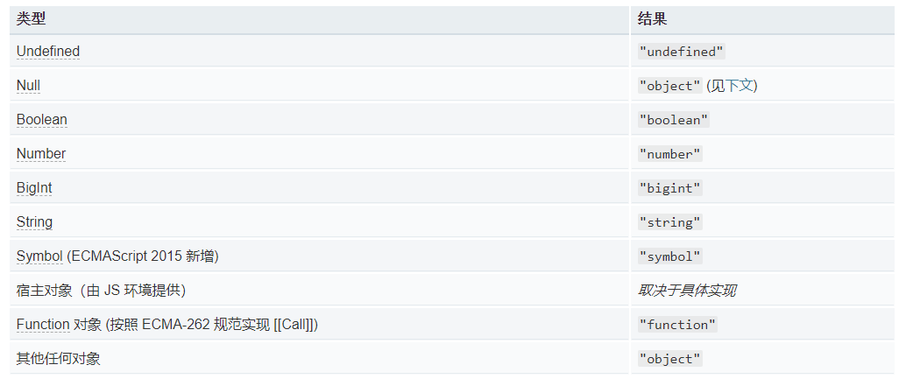
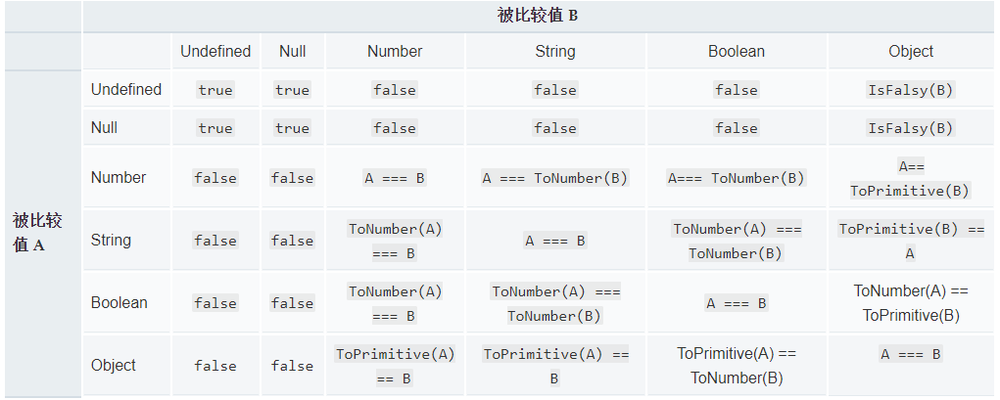
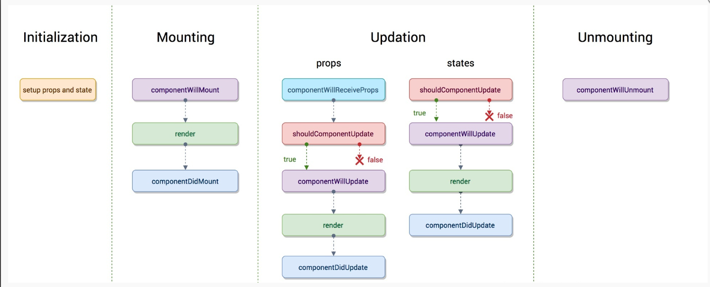
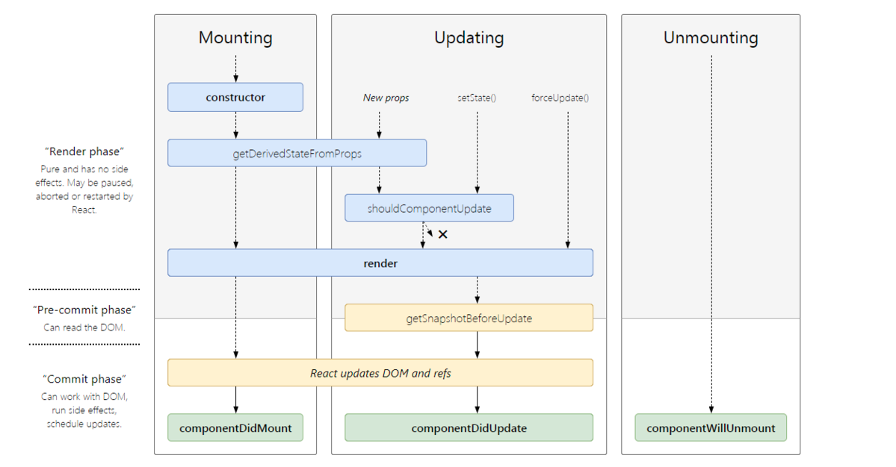
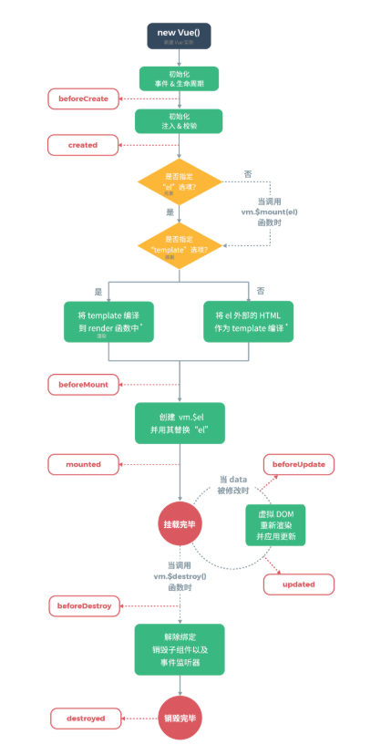

# 2019 年面试题

[2019 秋招知识盲点总结](https://segmentfault.com/a/1190000016329715?utm_source=tag-newest#item-6)

## html、CSS 篇

1.  浏览器回流与重绘过程？触发回流和重绘的条件？

    重绘：改变色彩（不影响布局）
    回流：浏览器为了重新渲染部分或者全部的文档而从新计算文档中元素的位置和几何构造的过程

    [参考文档](https://segmentfault.com/a/1190000017329980)

2.  flex 常见属性

    Flex 即：Flexible Box，弹性布局，用来为盒状模型提供最大的灵活性。可以实现类似垂直居中布局

    设为 Flex 布局以后，子元素的 float、clear 和 vertical-align 属性将失效

    - 采用 Flex 布局的元素，称为 Flex 容器（flex container）
    - 所有子元素自动成为容器成员，称为 Flex 项目（flex item）

    容器有 6 个属性

    - flex-direction 决定主轴的方向
    - flex-wrap 定义，如果一条轴线排不下，如何换行
    - flex-flow 是 flex-direction 属性和 flex-wrap 属性的简写形式，默认值为 row nowrap
    - justify-content 定义了项目在主轴上的对齐方式
    - align-items 定义项目在交叉轴上如何对齐
    - align-content 定义了多根轴线的对齐方式。如果项目只有一根轴线，该属性不起作用。

    项目有 6 个属性

    - order 定义项目的排列顺序。数值越小，排列越靠前，默认为 0。
    - flex-grow 定义项目的放大比例，默认为 0，即如果存在剩余空间，也不放大
    - flex-shrink 定义了项目的缩小比例，默认为 1，即如果空间不足，该项目将缩小。负值对该属性无效
    - flex-basis 在分配多余空间之前，项目占据的主轴空间（main size）。浏览器根据这个属性，计算主轴是否有多余空间。它的默认值为 auto，即项目的本来大小。
    - flex 是 flex-grow, flex-shrink 和 flex-basis 的简写，默认值为 0 1 auto。后两个属性可选。
    - align-self 允许单个项目有与其他项目不一样的对齐方式，可覆盖 align-items 属性。默认值为 auto，表示继承父元素的 align-items 属性，如果没有父元素，则等同于 stretch

3.  BFC

    BFC 即 Block Formatting Contexts (块级格式化上下文)，它属于普通流，即：元素按照其在 HTML 中的先后位置至上而下布局，在这个过程中，行内元素水平排列，直到当行被占满然后换行，块级元素则会被渲染为完整的一个新行，除非另外指定，否则所有元素默认都是普通流定位，也可以说，普通流中元素的位置由该元素在 HTML 文档中的位置决定

    可以把 BFC 理解为一个封闭的大箱子，箱子内部的元素无论如何翻江倒海，都不会影响到外部。

    只要元素满足下面任一条件即可触发 BFC 特性：

    - body 根元素
    - 浮动元素：float 除 none 以外的值
    - 绝对定位元素：position (absolute、fixed)
    - display 为 inline-block、table-cells、flex
    - overflow 除了 visible 以外的值 (hidden、auto、scroll)

4.  css 模块化

    模块化 CSS 是一组编写代码的原则，基于这个原则编写的代码具有高性能和可维护性

    [参考资料](https://juejin.im/post/5bb6c5195188255c9e02e6f30)

    [Styled Components](http://www.alloyteam.com/2017/05/guide-styled-components/)

5.  什么是 DOCTYPE 及作用？常见的 doctype 有哪些？

    用来声明文档类型和 DTD 规范的。

    DTD（document type definition）文档类型定义，是一系列的语法规则，用来声明 XML 或(X)HTML 的文件类型，浏览器会使用它来决定文档类型，决定使用何种协议来解析，以及切换浏览器模式。

    常见的 doctype:

    - HTML5\<!DOCTYPE html>
    - HTML4.01 Strict 严格模式 （不包含展示性或弃用的元素）
    - HTML4.01 Transitional 传统(宽松)模式（包含展示性或弃用的元素）

## js 篇

1. js 数据类型

   基本数据类型：Number、String、Boolean、Null、Undefined

   混合数据类型：Object

2. var、let 与 const 的区别

   - var 存在变量提升，let 没有
   - let 存在块级作用域，var 没有
   - let 存在暂时性死区
   - let 不允许重复声明
   - const 声明常量。声明后，基本类型数据（string、number）不可更改，object 内的属性值可以修改

   [es6 let 篇](https://es6.ruanyifeng.com/#docs/let)

   ```
     var a="abc"
     function a(){}
     console.log(a)  //"abc"
   ```

   或

   ```
     let a="abc"
     function a(){}
     console.log(a)  //Uncaught SyntaxError: Identifier 'a' has already been declared
   ```

   [Javascript 变量生命周期](https://juejin.im/post/5d2fb820e51d454f723025bb)

3. promise 执行顺序

   ```
   console.log(1)
   setTimeout(()=>{
       console.log(2)
   },0)
   new Promise((resolve,rejects)=>{
       console.log(3)
       resolve()
   }).then(()=>{
      console.log(4)
   });
   new Promise((resolve,rejects)=>{
      console.log(5)
      resolve()
   }).then(()=>{
      console.log(6)
   })
   console.log(7)

   //1 3 5 7 4 6 2 执行顺序
   ```

   微任务队列 Promise，process.nextTick、MutationObserver
   宏任务队列 定时器(setTimeout、setIntervcal、setImmediate)、异步 I/O(http 网络请求、DOM 事件)

   考察点：js 的 Event loop 之微任务与宏任务

   [参考资料](https://juejin.im/post/5b498d245188251b193d4059)

4. 防抖(debounce)与节流(throttle)

   - 防抖：如果用户多次调用且间隔小于 wait 值，那么就会被转化为一次调用。
   - 节流：多次执行函数转化为，每隔一定时间（wait）调用函数 。

   一个简单的防抖函数:

   ```
   function debounce(func, wait) {
       let timer = null;
       return function(...params) {
           // 如果定时器存在则清除
           if(timer){
               clearTimeout(timer);
           }
           // 重新开始定时执行
           timer = setTimeout(() => {
               func.apply(this, params);
           }, wait);
       }
   }
   ```

   一个简单的节流函数：

   ```
   function throttle(func, wait) {
       var timer = null;
       var context = null;
       return function(...args) {
           context = this;
           if(!timer) {
               timer = setTimeout(function() {
                   timer = null;
                   func.apply(context, args);
               }, wait);
           }
       }
   }
   ```

5. call、apply 和 bind

   自定义 call、apply 和 bind 见[2019 秋招知识盲点总结](https://segmentfault.com/a/1190000016329715?utm_source=tag-newest#item-6)

   ```
     function a(p){
         console.log(p)
     }
     a.call(null,1,2,3)  //1
   ```

   ```
     function a(p){
         console.log(p)
     }
     let b=a.bind(this,1)
     b(4) //1
     let c=a.bind(this,1,2,3)
     c(4) //1
     let d=a.bind(this)
     d(4) //4
   ```

6. 箭头函数与普通函数的区别

   - 函数体内的 this 对象，就是定义时所在的对象，而不是使用时所在的对象。
   - 不可以当作构造函数，也就是说，不可以使用 new 命令，否则会抛出一个错误。
   - 不可以使用 arguments 对象，该对象在函数体内不存在。如果要用，可以用 rest 参数代替。
   - 不可以使用 yield 命令，因此箭头函数不能用作 Generator 函数。
   - 箭头函数可以让 this 指向固定化，这种特性很有利于封装回调函数。
   - 在 class 里面定义箭头函数，实例化后，定义的箭头函数不在原型上，而是实例内部方法
   - 箭头函数的 this 永远指向其上下文的 this ，任何方法都改变不了其指向，如 call() , bind() , apply()
   - 普通函数的 this 指向调用它的那个对象

   原理: this 指向的固定化，并不是因为箭头函数内部有绑定 this 的机制，实际原因是箭头函数根本没有自己的 this，导致内部的 this 就是外层代码块的 this。正是因为它没有 this，所以也就不能用作构造函数

   [js 中箭头函数和普通函数的区别](https://segmentfault.com/a/1190000018902542)

7. js 常见兼容问题

   - e 事件对象的兼容
     ```
     var e = e || window.event
     ```
   - 屏幕尺寸的兼容问题
     ```
     document.documentElement.clientWidth || document.body.clientWidth
     ```
   - 事件对象属性
     ```
     var target = e.target || e.srcEement
     ```
   - 阻止事件冒泡
     ```
     cancelBubble()  return false //ie
     e.stopPropagation()
     ```
   - 添加事件
     ```
     ele.addEventLisener("click" , fn)
     ele.attchEvent('onclick',fn) //这是早期IE浏览器（IE8及早期版本）的一个专有的替代性标准
     attachEvent() 不再被IE11支持。
     EventTarget.addEventListener()被IE9+支持
     ```
     [js 常见兼容问题](https://www.jianshu.com/p/0137498286e3)

8. 判断变量的类型方法有哪些？

- typeof 操作符返回一个字符串，表示未经计算的操作数的类型

  typeof 判断数据类型:

  

- instanceof 运算符用于检测构造函数的 prototype 属性是否出现在某个实例对象的原型链上

语法 ：

```
  object instanceof constructor

  object 某个实例对象
  constructor 某个构造函数
```

9. js 值比较方法

   - 严格相等 ("triple equals" 或 "identity")，使用 ===
   - 宽松相等 ("double equals") ，使用 ==
   - 以及 Object.is （ECMAScript 2015/ ES6 新特性）

   非严格比较值转换方式

   

10. js 原型链链式的指向问题

   constructor 指向构造函数

   \_\_proto\_\_ 指向实例的原型

11. js 常见内存泄漏

    - 意外的全局变量
    - 被遗忘的计时器或回调函数
    - 脱离 DOM 的引用
    - 闭包

    [js 常见的内存泄漏](https://www.cnblogs.com/cwxwdm/p/10845376.html)

12. new 操作符执行了哪些操作

    1. 创建一个新对象；
    2. 将构造函数的作用域赋给新对象（因此 this 就指向了这个新对象）；
    3. 执行构造函数中的代码（为这个新对象添加属性）；
    4. 返回新对象；

    ```
    function new(Con,...arg){
      let obj={}
      Object.setPrototypeOf(obj,Con.prototype)
      let result=Con.apply(obj,arg)
      return result instanceof Object?result:obj
    }
    ```

13. require 与 import 的区别

    require 属于 CommonJS 模块化规范，运行时调用

    import 属于 es6 语法规范，编译时调用

    [require 与 import 的区别](https://juejin.im/post/5c46b6b76fb9a04a09565e86)

14. 浏览器环境与 node 环境事件循环的区别

    [node 环境的事件循环](https://zhuanlan.zhihu.com/p/37427130)

    [浏览器与 Node 的事件循环(Event Loop)有何区别](https://www.jianshu.com/p/5f1a8f586019)

## React 篇

[2019 年 17 道高频 React 面试题及详解](https://juejin.im/post/5d5f44dae51d4561df7805b4)

1.  react 生命周期

    react15 生命周期

    

    React 16 之后有三个生命周期被废弃(但并未删除)

    - componentWillMount
    - componentWillReceiveProps
    - componentWillUpdate

    新增一个生命周期：getDerivedStateFromProps

    react16 生命周期

    

2.  react16 新增了哪些东西？

    - render 支持返回数组和字符串
    - 新生命周期 getDerivedStateFromProps，getSnapshotBeforeUpate
    - createPortal，modal 传送到任意位置
    - 新增指针事件
    - 给函数式组件加 memo，实现性能优化
    - 懒加载组件，lazy, suspense
    - react hooks

    [react16 新特性](https://www.jianshu.com/p/24ed0bc34c12?utm_campaign=maleskine&utm_content=note&utm_medium=seo_notes&utm_source=recommendation)

3)  React.Component 和 React.PureComponent 区别

    - 继承 PureComponent 时，不能再重写 shouldComponentUpdate
    - React.PureComponent 基于 shouldComponentUpdate 做了一些优化，通过 prop 和 state 的浅比较来实现 shouldComponentUpdate，也就是说，如果是引用类型的数据，只会比较是不是同一个地址，而不会比较具体这个地址存的数据是否完全一致。

4)  react 函数组件和类组件

    [react-函数组件和类组件的区别](https://segmentfault.com/a/1190000020861150)

5)  react 函数组件

    [精读《Function Component 入门》](https://segmentfault.com/a/1190000019300727)

6)  react 中为何要绑定 this

    react 组件实例化后，render 方法中的 JSX 中的 this 并不指向自身，此时 this 指向事件响应时的上下文环境，并不是组件实例

    react 中绑定 this 的几种方法

    - bind 方法
    - 组件类中使用箭头函数方法
    - jsx 语法中使用箭头函数

    ```
      onClick={()=>{this.cb()}}
    ```

    [React 中为什么要绑定 this](https://oychao.github.io/2017/07/14/react/14_this/)

7)  setState 的同步和异步问题

    在 react 中由 react 引发的 React 引发的事件处理（比如通过 onClick 引发的合成事件处理）和组件生命周期函数内（比如 componentDidMount）调用 setState 为异步执行
    在 js 原生异步函数中(如 setTimeout)调用 setState 为同步执行

    [浅入深出 setState（上篇）](https://segmentfault.com/a/1190000015615057)

    [浅入深出 setState（下篇）](https://segmentfault.com/a/1190000015821018)

8)  React 合成事件

    [React 合成事件文档](https://zh-hans.reactjs.org/docs/events.html)

    [React 合成事件和 DOM 原生事件混用须知](https://juejin.im/post/59db6e7af265da431f4a02ef)

9)  react Fiber 架构

    [React Fiber 原理介绍](https://segmentfault.com/a/1190000018250127)

# vue 篇

[vue 面试知识点](https://segmentfault.com/a/1190000020181662?utm_source=tag-newest)

1.  vue 生命周期

    - beforeCreate（创建前） 在数据观测和初始化事件还未开始
    - created（创建后） 完成数据观测，属性和方法的运算，初始化事件，\$el 属性还没有显示出来
    - beforeMount（载入前） 在挂载开始之前被调用，相关的 render 函数首次被调用。实例已完成以下的配置：编译模板，把 data 里面的数据和模板生成 html。注意此时还没有挂载 html 到页面上。
    - mounted（载入后） 在 el 被新创建的 vm.\$el 替换，并挂载到实例上去之后调用。实例已完成以下的配置：用上面编译好的 html 内容替换 el 属性指向的 DOM 对象。完成模板中的 html 渲染到 html 页面中。此过程中进行 ajax 交互。
    - beforeUpdate（更新前） 在数据更新之前调用，发生在虚拟 DOM 重新渲染和打补丁之前。可以在该钩子中进一步地更改状态，不会触发附加的重渲染过程。
    - updated（更新后） 在由于数据更改导致的虚拟 DOM 重新渲染和打补丁之后调用。调用时，组件 DOM 已经更新，所以可以执行依赖于 DOM 的操作。然而在大多数情况下，应该避免在此期间更改状态，因为这可能会导致更新无限循环。该钩子在服务器端渲染期间不被调用。
    - beforeDestroy（销毁前） 在实例销毁之前调用。实例仍然完全可用。
    - destroyed（销毁后） 在实例销毁之后调用。调用后，所有的事件监听器会被移除，所有的子实例也会被销毁。该钩子在服务器端渲染期间不被调用

    

2.  vue keep-alive 的使用及实现原理

    [聊聊 keep-alive 组件的使用及其实现原理](https://segmentfault.com/a/1190000011978825)

    [React 中的状态自动保存（KeepAlive）](https://juejin.im/post/5d7edee9f265da03a9506701)

    [React 怎么实现 Vue 的 <keep-alive> 组件](https://juejin.im/post/5c8f6635f265da612254a9cd)

3.  vue 的双向绑定原理及其实现
    [vue 的双向绑定原理及实现](https://juejin.im/entry/5923973da22b9d005893805a)

# webpack 篇

[前端面试之 webpack 面试常见问题](https://www.jianshu.com/p/f1b88a05d774)

[webpack编译流程](https://juejin.im/post/6844903935828819981)

[深入浅出webpack](https://webpack.wuhaolin.cn/)

1.  webpack 热跟新原理

    [Webpack 热更新实现原理分析](https://www.jianshu.com/p/652fbae768bf)

2.  webpack loader 和 plugin

    loader 是转译模块源代码的转换规则。 loader 被编写为，接受源代码作为参数的函数， 并返回这些转换过的新版本代码
    plugin 接口可以帮助用户直接触及到编译过程(compilation process)。 插件可以将处理函数(handler)注册到编译过程中的不同事件点上运行的生命周期钩子函数上。 当执行每个钩子时， 插件能够完全访问到编译(compilation)的当前状态。

    [webpack 编写 loader 文档](https://webpack.js.org/contribute/writing-a-loader/)

    [webpack 编写 plugin 文档](https://webpack.js.org/contribute/writing-a-plugin/)

3.  精简 moment 的 plugin 配置

    - 使用 ContextReplacementPlugin

    ```
     new webpack.ContextReplacementPlugin(/moment[\/\\]locale$/, /zh-cn/)
    ```

    - 使用 IgnorePlugin

    ```
      new webpack.IgnorePlugin(/^\.\/locale$/, /moment$/),
    ```

    [如何用 webpack 优化 moment.js 的体积](https://juejin.im/post/5de4fe59f265da05b52e893b)

# http 篇

[前端面试整理 -- HTTP 篇](https://zhuanlan.zhihu.com/p/83624993)

[HTTP 和 Ajax 面试题](https://www.jianshu.com/p/44b3f37eb2e7)

[HTTP 与 HTTPS](https://juejin.im/post/5c6e5803f265da2dc0065437)

1. http2.0 相较于 http1.1 版本有哪些改进

   [HTTP2 详解](https://www.jianshu.com/p/e57ca4fec26f)

   - http2.0 实现了单连接上多请求 - 响应并行，解决了线头阻塞的问题，减少了 TCP 连接数量和 TCP 连接慢启动造成的问题（http1.1 在每个 TCP 连接同时只能处理一个请求 - 响应，为串行）
   - http2.0 可进行服务端推送

2. http 缓存，强缓存和协商缓存

   [强制缓存和协商缓存](https://juejin.im/post/5ccfccaff265da03ab233bf5)

3. get 请求和 post 请求区别

   - POST 对请求参数的长度没有限制，而 GET 如果请求参数过长，会被浏览器截断
   - GET 请求参数会直接暴露在 URL 上，所以不适合用来传递敏感信息。
   - GET 请求可以被浏览器主动缓存，而 POST 请求不可以，除非手动设置。
   - GET 请求在浏览器回退时是无害的，而 POST 会再次提交请求。
   - GET 请求产生的 URL 可以被浏览器缓存，而 POST 不可以。
   - Get 请求具有幂等性，POST 请求不是(最重要一点)

   [GET 和 POST 区别](https://juejin.im/entry/597ca6caf265da3e301e64db)

4. websocket

   - websocket 共有四次握手(tcp 三次，websocket 一次)
   - webSocket 支持文本和二进制数据传输

   [WebSocket 浅析](https://www.jianshu.com/p/bc7d1a260c0c)

5. 跨域
   - jsonp([JSONP 跨域详解](https://www.jianshu.com/p/e1e2920dac95))
   - [CROS 跨域](https://developer.mozilla.org/zh-CN/docs/Web/HTTP/Access_control_CORS)(简单请求和复杂请求)
   - 代理

# 其他

1. 安全类

   - CSRF，跨站请求伪造（Cross-site request forgery）

     防御措施：

     Token 验证（请求必须携带 Token）

     Referer 验证（验证请求的来源是否可信）

     [前端安全系列之二：如何防止 CSRF 攻击？](https://juejin.im/post/5bc009996fb9a05d0a055192)

   - XSS（cross-site scripting 跨站脚本攻击）

     原理：注入脚本

     防御措施：对用户的输入做验证

     [前端安全系列（一）：如何防止 XSS 攻击？](https://tech.meituan.com/2018/09/27/fe-security.html)

2. 首屏加载速度优化

   [参考资料](https://zhuanlan.zhihu.com/p/56121620)

3. 前端性能优化

   [2019 年前端性能优化清单 — 上篇](https://juejin.im/post/5c46cbaee51d453f45612a2c)

   [2019 年前端性能优化清单 — 中篇](https://juejin.im/post/5c471eaff265da616d547c8c)

   [2019 年前端性能优化清单 — 下篇](https://juejin.im/post/5c473cdae51d45518d4701ff)
